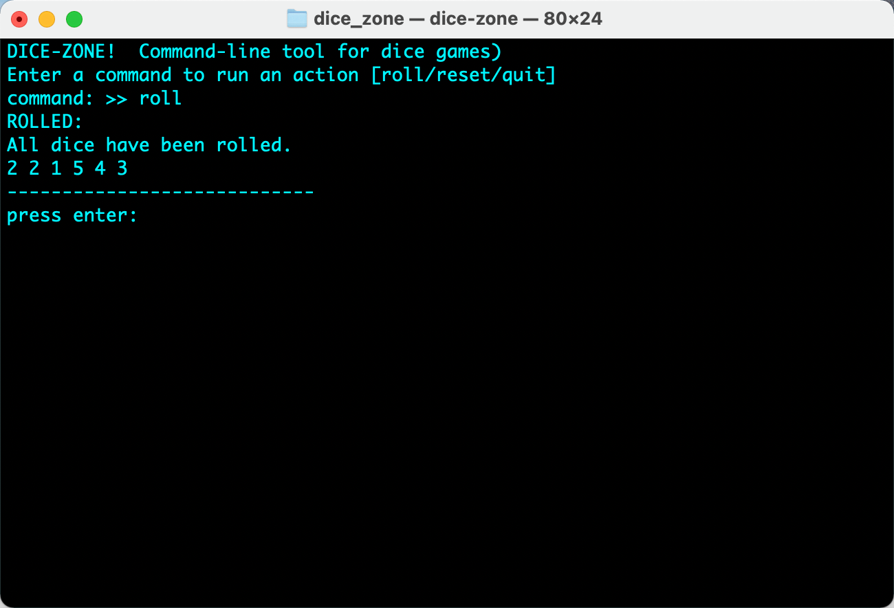

# DiceZone for command-line. 🎲

## About

* * *

Dice are small, throwable objects with marked sides
that can rest in multiple positions. They are used
for generating random numbers, commonly as part of
tabletop games, including dice games, board games,
role-playing games, and games of chance.

DiceZone is a dice rolling simulator application that
really puts you in the zone. Gain the ability to roll
dice from within the command-line.

### Usage

The roll command will roll the dice on the imaginary
table.

The reset command is used to set all die to their
initial values for reuse in the game your playing.

You know what the quit command does, it's there to
simply quit the application.

## Program Preview

* * *



## Tooling information

* * *

Targeted audience we are building for is MacOSX and Linux users. This project uses
[Meson](https://mesonbuild.com/) `0.56.0` and newer.

## Setup, Compile and Install

* * *

Firstly the users should set up a project build directory before
compiling:

```console
meson setup builddir
```

The next step should be to compile the target of a configured
Meson project:

```console
meson compile -C builddir
```

Then we install the application like so:

```console
meson install -C builddir
```

And finally we run this cool application:

```console
dice-zone
```

## Contact the developer

* * *

You may find that I have a number of ways that you can contact
me. All of these methods happen to be listed on my blogging platform
[Mike's virtual office](https://michaelbrockus.home.blog/contact/).

Lastly don't forget to have a cup of virtual coffee. Thanks.

